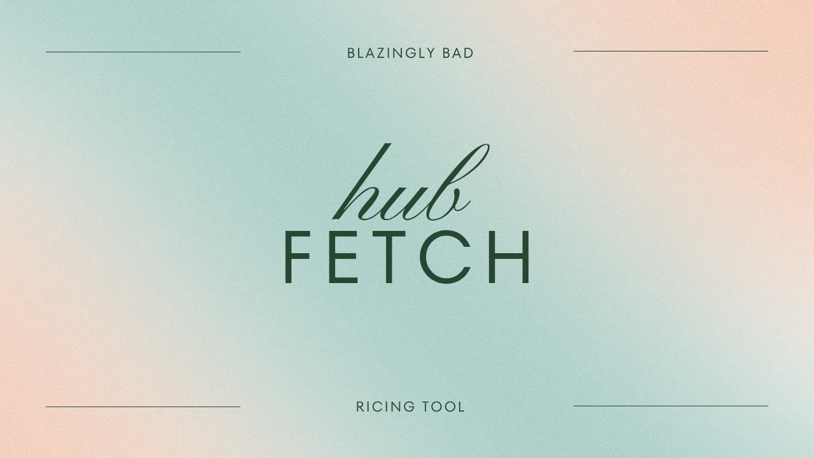
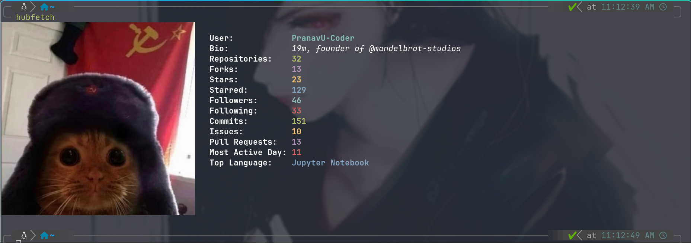
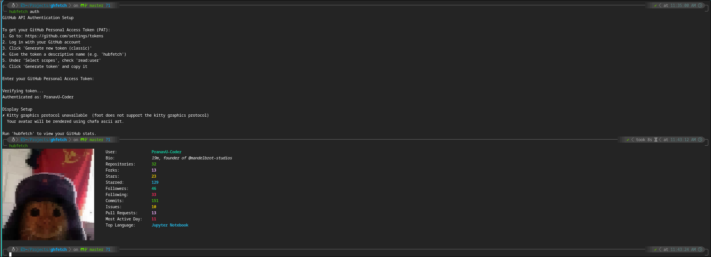
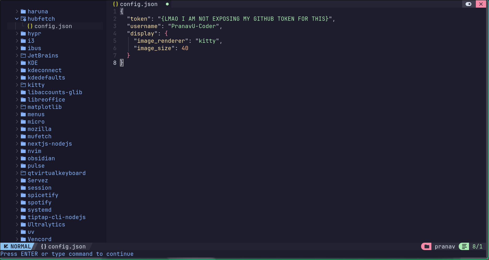
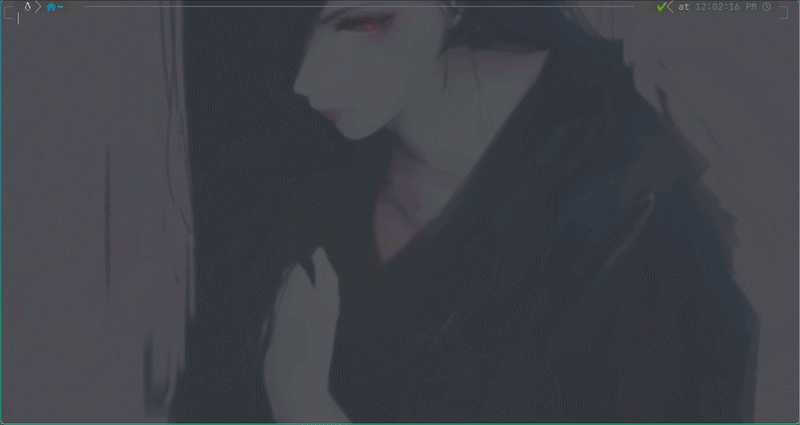

# hubfetch

## Description

A [not very minimal] fetching tool for your GitHub profile. Flex at your friends from terminal itself without even opening a new tab.

This entire script is written purely in python and uses GitHub's REST API for acquiring details of your profile, you can opt out of certain fields and even change the image rendered in accordance to your needs by editing at ~/.config/hubfetch.json

The image rendered depends heavily on the terminal as it requires kitty's graphics protocol and full image rendering is supported in those terminals which are capable enough of supporting it.

Don't worry if your favorite terminal doesn't support kitty's graphics protocol as the script downloads [chafa](https://hpjansson.org/chafa/) as fallback to display your profile picture in ASCII-block art format.

### Terminals Supporting Kitty's Graphics Protocol

* **[Kitty](https://sw.kovidgoyal.net/kitty/)** (Native support)
* **[WezTerm](https://wezfurlong.org/wezterm/)**
* **[Ghostty](https://ghostty.org/)**
* **[Konsole](https://konsole.kde.org/)** (KDE's default terminal)

## Previews

First Time Installation & Kitty/Non-Kitty Looks

## Features

* **Comprehensive GitHub Stats**: Fetches real-time (ok maybe not that real-time, there is caching of data that is maintained each hour) data  including repositories, total stars, forks, followers, and following count.
* **Contribution Tracking**: Displays your total commits, open issues, and pull requests from the current year using GitHub's GraphQL API.
* **Image Rendering**: 
    * **High-Res:** Utilizes the Kitty graphics protocol for native, high-resolution avatar rendering.
    * **Legacy/Fallback:** Automatically detects terminal capabilities and falls back to `chafa` for high-quality ANSI symbols/block art.
* **Caching**: 
    * **Avatar Cache:** Refreshes your profile picture every 6 hours.
    * **Stats Cache:** Keeps your GitHub data fresh with a 1-hour expiration to minimize API calls and maximizes speed.
* **Dynamic Customization**: Fully configurable via `~/.config/hubfetch/config.json` as discussed earlier. Toggle individual fields, adjust image dimensions, or customize the entire color palette with bold and italic Rich styles.
* **Secure Authentication**: Dedicated `auth` command to securely handle GitHub Personal Access Tokens (PAT) and verify credentials before setup.
* **Modern CLI Experience** – Built with `Click` for a seamless command-line interface and `Rich` for beautiful, side-by-side terminal layouts.

## Dependencies

**[Chafa](https://hpjansson.org/chafa/)** (Highly Recommended): Used as the primary fallback for terminals that do not support the Kitty graphics protocol. It converts your GitHub avatar into high-quality ANSI symbols/block art.

While the script does attempt to install in case terminal emulator appears to not support Kitty's graphics protocol, it is highly recommended to install manually in the event that chafa installation fails.

## Installation

[WIP]

## Tech Stack

## Future

Discussed in [discussions](https://github.com/PranavU-Coder/hubfetch/discussions)

All features/bug-fixes being implemented can be visible in the [roadmap](https://github.com/users/PranavU-Coder/projects/11)

A rich [issue-template](https://github.com/PranavU-Coder/hubfetch/issues) to raise all required changes.

## License

[MIT](https://github.com/PranavU-Coder/hubfetch?tab=MIT-1-ov-file)

## Other

<a href="https://www.star-history.com/?repos=PranavU-Coder%2Fhubfetch&type=date&legend=top-left">
 <picture>
   <source media="(prefers-color-scheme: dark)" srcset="https://api.star-history.com/chart?repos=PranavU-Coder/hubfetch&type=date&theme=dark&legend=top-left" />
   <source media="(prefers-color-scheme: light)" srcset="https://api.star-history.com/chart?repos=PranavU-Coder/hubfetch&type=date&legend=top-left" />
   
 </picture>
</a>
